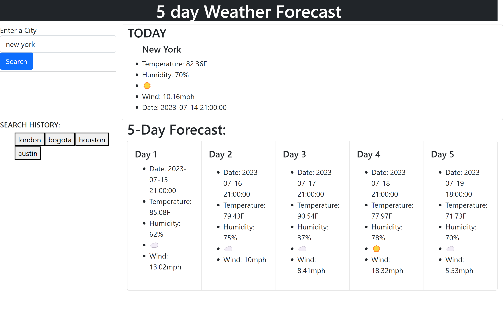

# Weather-Dashboard
Challenge 06

## Description
This assignment was created to showcase the skills of May Pham to incorporate HTML, JQuery, and CSS to create a 5 day weather forecast to display weather information that consists of a search history button. 2 api urls were used to call a weather API for data on temperature, humidity, wind, etc. 

## Usage

https://github.com/mayphamx/Weather-Dashboard

https://mayphamx.github.io/Weather-Dashboard/ 